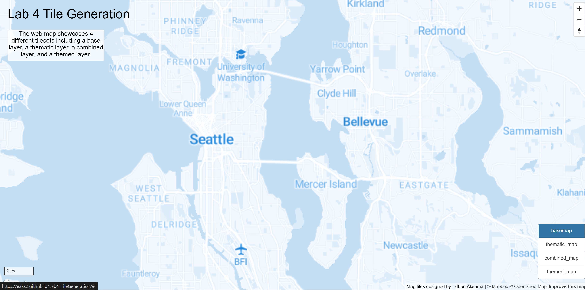
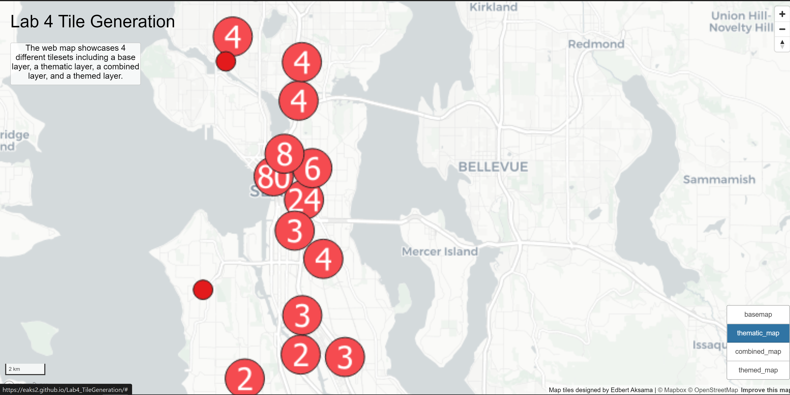
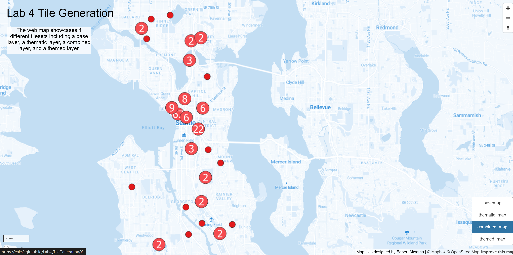

# Tile Generation Lab4
#### By Edbert Aksama
--- 
### Introduction
The [web map](https://eaks2.github.io/Lab4_TileGeneration/) examines the puget sound area, specifically the city of Seattle and its surrounding area. In order to ensure that the web map was able to be uploaded to github and to have a fast and proper load, each tile set has a minimum zoom level of 1 and a maximum zoom level of 11.

## Layers
---
### Basemap

The basemap that was created utilizing a template base map that is provided by MapBox. Since the basemap is usually overlain with other thematic layer, I decided to make the basemap in a monochrome light blue color. Furthermore, icons for points of interest are also added onto the layer. 

### Thematic Layer

The thematic layer shows crime offences that falls under the Drug/Narcotic Offences parent group that have been recorded so far in Seattle in 2022. The crime offences is symbolized both in single symbol and point cluster symbol that shows the number of offences within a cluster. 

### Combined Layer 

The combined layer includes the first basemap layer and the second thematic layer overlain on top of each other.

### Themed Layer 

For the themed layer that is relevant to my research interest, I chose to do a black lives matter(BLM) themed layer. In order to make the layer to have a BLM theme, I decided to use colors that are primarily found in the BLM movement. Furthermore, icons for points of interests are also added onto the layer. 

#### Sources 
[Data](https://data.seattle.gov/Public-Safety/SPD-Crime-Data-2008-Present/tazs-3rd5)
